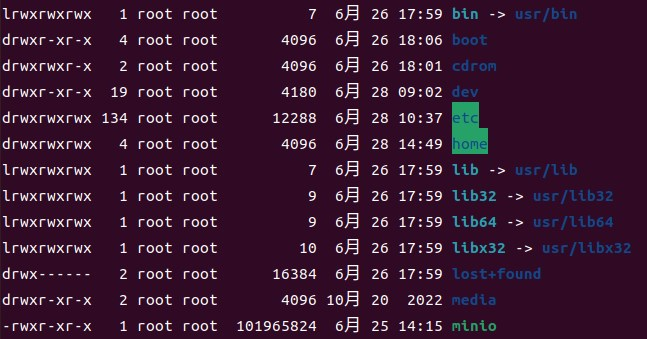

# Ubuntu

## 虚拟机安装

参考：[VirtualBox 安装 Ubuntu20.04 图文教程](https://zhuanlan.zhihu.com/p/504251587)


## 虚拟机设置

- 网络-桥接网卡
- 共享粘贴板


## 命令行

- 快捷键：`Ctrl+Alt+T`
- 查看当前目录：`ls`（追加 `-a` 参数可以查看隐藏文件）
- 创建目录：`sudo mkdir xxx`
- 递归删除文件夹：`sudo rm -r xxx`
- 全局查找某个文件：`sudo find / -name xxx`
- 查看 IP 地址：`ip addr` 
- 下载软件：`sudo apt install xxx`
- 删除软件：`sudo apt remove xxx`
- 查看已安装软件：`apt list --installed`
- 查看某个软件是否已安装：`apt show xxx`


## 服务/进程管理

- 查看服务状态：`service xxx status`
- 启动服务：`sudo service xxx start`
- 停止服务：`sudo service xxx stop`
- 重启服务：`sudo service xxx restart`
- 设置服务开机自启动：`sudo systemctl enable xxx`
- 关闭服务开机自启动：`sudo systemctl disable xxx`
- 查看某个服务：`ps -ef|grep xxx`
- 强制杀死某个进程：`sudo kill -9 <pid>`
- 强制杀死相关进程：`sudo killall -9 xxx`


## 用户权限

### 修改用户密码

```sh
sudo passwd xxx
```

### 命令行切换到某个用户

```sh
sudo su xxx
```

### 查看文件访问权限

```sh
ls -l
```

`-l` 参数可以查看访问权限，后面可以添加路径，默认当前路径



第 1 列表示访问权限，其中：

第 1 位表示文件类型，`d` 表示目录，`-` 表示文件，`l` 表示文件链接；

后面 9 位分为 3 组，每 3 位为 1 组，第 1 组表示文件所有者权限（`u`），第 2 组表示所属组权限（`g`），第 3 组表示其他用户权限（`o`）；

`r` （read）表示读权限，`w`（write）表示写权限，`x`（execute）表示执行权限

### 修改用户访问权限

通过 `chmod [用户类型]操作模式[权限] 文件路径`

- 用户命令：`u`（所有者） | `g`（所属组） | `o`（其他用户） | `a`（所有用户）
- 操作模式：`+`（添加权限） | `-`（删除权限） | `=`（直接修改权限）
- 权限：`r`（读） | `w`（写） | `x`（执行） | `-`（无权限，适用于 `=` 操作模式）

例如：

```sh
sudo chmod a+rwx /home
```

表示为所有用户添加`/home` 目录的读、写和执行权限

```sh
sudo chmod o-w /home
```

表示删除其他用户对 `/home` 目录的写权限


## 系统信息

| 信息     | 命令                |
| -------- | ------------------- |
| 操作系统 | `cat /proc/version` |
| CPU      | `lscpu`             |
| 内存     | `free`              |
| 硬盘     | `df -h`             |
| 系统占用 | `top`               |


## openssh-server

想要其他机器访问本机，就需要配置 ssh 服务。

- 安装：

```sh
sudo apt install openssh-server
```

- 检查状态：

```sh
systemctl status ssh
```


## 防火墙

- 查看防火墙状态

```sh
systemctl status firewalld
```

- 如果提示服务未找到，则需要先安装防火墙：

```sh
sudo apt-get install firewalld firewall-config
```

- 关闭防火墙

```sh
systemctl stop firewalld
```

- 重启防火墙

```sh
systemctl restart firewalld
```

- 查看防火墙开放端口

```sh
sudo firewall-cmd --zone=public --list-ports
```

- 开放指定端口

```sh
sudo firewall-cmd --zone=public --add-port=22/tcp --permanent
sudo firewall-cmd --reload
```

`permanent` 参数表示长期生效。

开放端口后需要重新加载配置才能生效。


## git

- 安装

```sh
sudo apt install git
```

- 检查是否安装完成

```sh
git
```

- 设置用户名邮箱

```sh
git config --global user.name "username"
git config --global user.email "example@email.com"
# 然后查看是否配置完成：
git config user.name
git config user.email
```

- 配置 ssh key

```sh
ssh-keygen -t rsa -C "example@email.com"
```

打开公钥进行复制、并添加到 Github 的 ssh key 设置页面

```sh
cat xxx/.ssh/id_rsa.pub
```


## nginx

### 安装

```sh
sudo apt install nginx
```

检查是否安装完成

```sh
nginx -v
```

浏览器访问 `localhost`，可以看到 nginx 的默认欢迎页


### 常用命令

查看服务状态

```sh
service nginx status
```

关闭服务

```sh
sudo service nginx stop
```

重启服务

```sh
sudo service nginx restart
```

设置任务开机自启动

```sh
sudo systemctl enable nginx
```


### 配置

首先，定位 nginx 的安装目录，`nginx.conf` 就是 nginx 的配置文件

```sh
sudo find / -name nginx.conf
```

修改配置文件：

```sh
http {
	server {
		listen		80;
		server_name  localhost; # 如果需要外部访问，则改为本机ip
		
		location /vite-project {
			alias	/home/web/vite-project;
			index	index.html index.htm;
			try_files $uri $uri/ index.html; # 设置文件查找规则，否则单页应用刷新/前进/后退会返回404页面
		}
	}
}
```

> 注意：修改 nginx 配置文件之后，需要重启 nginx 服务才能生效

> 注意：外部访问需要关闭防火墙或者开放对应端口

如果 `location` 设置了子路径，则前端项目需要设置公共基础路径和路由路径（以 vite+Vue3 项目为例）：

```typescript
// router/index.ts
import { createWebHistory } from 'vue-router';

// ...

const router = createRouter({
  routes,
  history: createWebHistory(import.meta.env.VITE_BASE_URL), // 设置路由基础路径
});
```

```typescript
// vite.config.ts
import { defineConfig, ConfigEnv, loadEnv } from 'vite';
import vue from '@vitejs/plugin-vue';

export default defineConfig(({ mode }: ConfigEnv) => {
  const env = loadEnv(mode, process.cwd());

  return {
    base: env.VITE_BASE_URL, // 设置公共基础路径
    plugins: [vue()],
  };
});
```

```sh
# .env.production
VITE_BASE_URL = /vite-project/
```

```sh
# .env.development
VITE_BASE_URL = /
```
